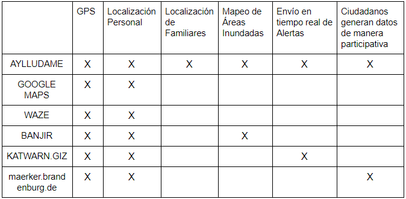
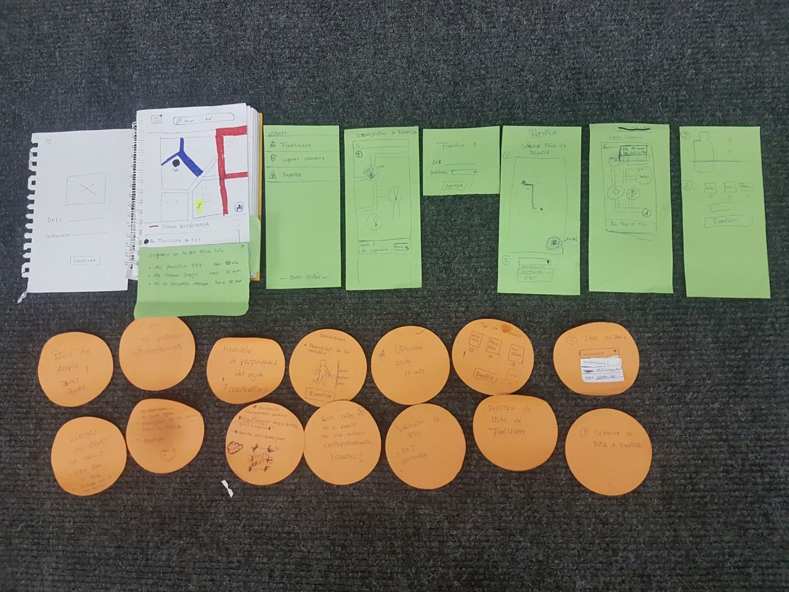
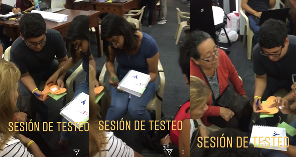
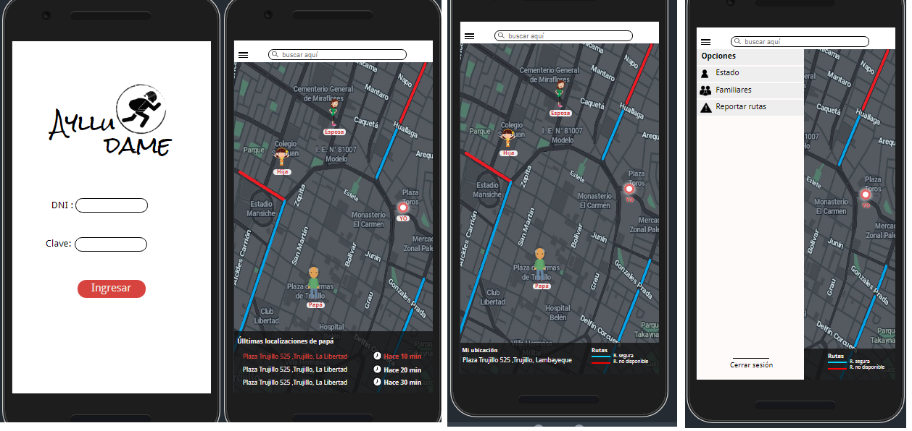
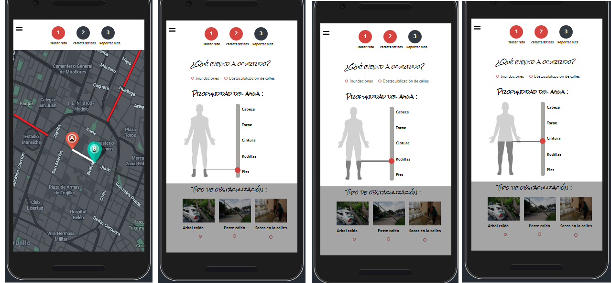

## Aylludanos

Aylludanos es una aplicación que ayuda a pobladores en casos de desastres naturales a localizar familiares y reportar zonas afectadas.

## Desarrollado para el Programa Global TICs para la Adaptación al cambio climático en cuidades (TIC-A)
[TIC-A](http://adaptaton18.pe/).s

## producto de desarrollado por :

- Ruth Mery Cárdenas P.
- Maythe Infante V.
- Maricarmen Rojas T.
- Roberto Gonzalez C.

## ¿Cómo nace Aylludanos?

Aylludanos nace gracias una necesidad detectada por los pobladores de El Porvenir (Trujillo, La Liberdad), gravemente afectados por el último huayco sucedido en marzo de 2017  

## ¿Cómo se empezó este proyecto?
 Primero se realizó un acercamiento al problema planteado meadiante una **lluvia de ideas** realizada por todos los integrantes el equipo [Ver aquí](https://realtimeboard.com/app/board/o9J_kz6g-dw=/l)
## Benchmark

 

## Conociedo más sobre el usuario final

Se realizó un modelo que representa a nuestro usuario final

## Priorización de funciones

Se realizó un lista de los funciones principales de nuestra aplicación :

 * Registro de usuario con DNI
 * Registro de lista de familiares
 * localización de familiares
 * Reporte de calles bloqueadas
 * Medición de profundidad del Agua
 * Registro de ubicaciòn de usuarios cada 1010min
 * Registro de de fotografías tomada por usuarios a zonas afectadas

## Prototipado de producto mínimo viable en baja fidelidad

## Testeo del primer Prototipo

## Prototipado de producto mínimo viable en alta fidelidad

